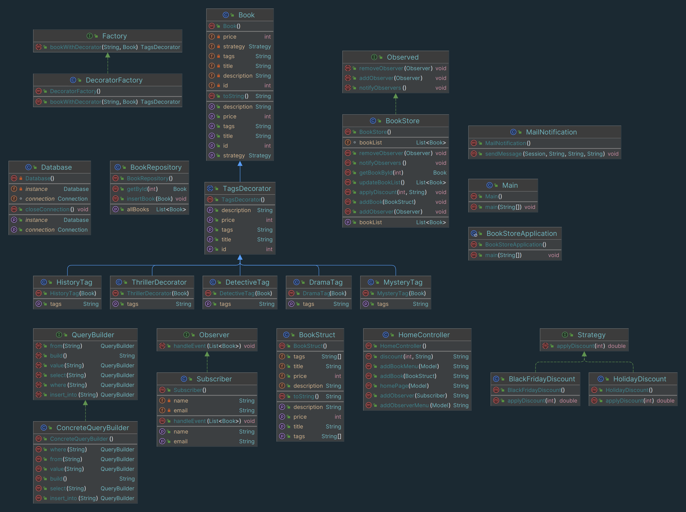

# SDP Final Project: Book Store

## Group: SE-2213
### Team Members:
- [Danil Li]
- [Seidulla Shalkharov]
- [Viktor Kossinov]

## Software Design Patterns Used:
- Singleton: Single database connection which will be used in multiple methods.
- Factory: Based on condition addition of different decorators.
- Observer: Email notification system.
- Strategy: Strategy for discount system.
- Decorator: Decorator for flex addition of multiple tags.
- Builder: Concrete creating of SQL queries.

## Frameworks used:
- Spring Boot
- MySQL

## Project Overview:
### Project Information:
Our project is a system of online bookstores designed to provide users with a convenient experience of viewing and selecting book genres.

### Project idea:
The goal of the project is to create a virtual bookstore where users will be able to get acquainted with a wide range of books with various genres

### Purpose of the work:
The purpose of this project is to introduce a fully functional online bookstore that simulates real scenarios of user interaction with dynamic book inventory.

### Work goals:
- Create an intuitive and user - friendly interface for viewing a book and choosing a genre .
- Implement various software design patterns to improve the project structure and ease of maintenance.

### UML Diagram:

## Conclusion:
### Key Points:
- Successfully implemented various design patterns to enhance the project's architecture.
- Provided a range of features to create a comprehensive online bookstore system.

### Project Outcomes:
- Achieved a functional and modular online bookstore with a clear separation of concerns.
- Faced challenges in integrating different design patterns seamlessly.

### Future Improvements:
- Enhance the user interface for a more engaging experience.
- Expand the book inventory and explore additional features for users.
- Add more possibilities for our website.

